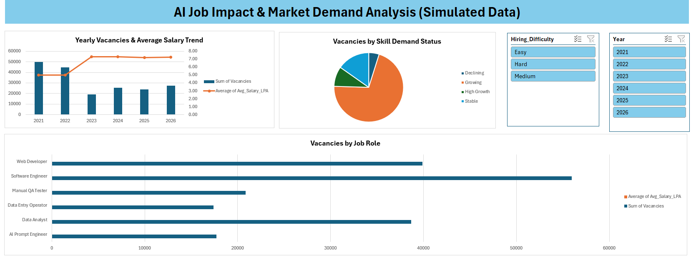

# AI Job Impact & Market Demand Analysis (Simulated Data)

This is a practice project where I analysed how AI might change job demand, salaries and skills for 6 roles between 2021 and 2026. I used Python, SQL, Excel and Power BI.

> **Note:** The data in this project is **simulated (not real)**. I generated it with Python (`PYTHON/AI_Job_Impact_Data_Generation.ipynb`) so that I could practice the full analysis steps. The results do **not** show the real job market. This project is only for learning.

---

## About the Project

- **Data:** 1,500 rows and 9 columns, years 2021 to 2026, 6 job roles
- **What I wanted to check:** how vacancies, salaries, skills and degree requirements change before AI (2021-2022) and after AI (2023-2026). I chose these two periods myself.
- **Tools:** Python, SQL (SQL Server), Excel, Power BI

## Dataset

| Column | Meaning |
| --- | --- |
| Year | 2021 to 2026 |
| Job_Role | Web Developer, Data Analyst, Software Engineer, Data Entry Operator, Manual QA Tester, AI Prompt Engineer |
| Vacancies | Number of openings |
| Hiring_Difficulty | Easy, Medium or Hard |
| Top_Required_Skill | Main skill for that role |
| Skill_Demand_Status | Stable, Growing, High Growth or Declining |
| Degree_Importance | Low, Medium or High |
| Portfolio_Weightage_Percentage | How much a portfolio matters in hiring (20 to 94) |
| Avg_Salary_LPA | Average salary in lakhs per year |

There are no missing values (I checked with `df.info()`). AI Prompt Engineer has no rows for 2021 and 2022 because I treated it as a new role.

## Project Structure

```text
AI-Job-Impact-Market-Demand-Analysis/
│
├── DATA/
│   └── ai_job_impact_data.csv
│
├── PYTHON/
│   ├── AI_Job_Impact_Data_Generation.ipynb
│   └── AI_Impact_On_Job_Python_Analysis.ipynb
│
├── SQL/
│   ├── create db.sql
│   └── Query 1 ... Query 10 (.sql files)
│
├── Excel/
│   ├── AI_Job_Impact_Analysis.xlsx
│   └── excel_dashboard.png
│
├── POWER BI/
│   ├── AI Job Impact & Market Demand Analysis Dashboard.pbix
│   └── powerbi_dashboard.png
│
├── Documentation/
│   └── AI_Job_Impact_Project_Documentation.pdf
│
└── README.md
```

## What I Did

### Python
- Made the dataset with NumPy (seed 42).
- Loaded it with Pandas and checked data types and missing values.
- Grouped the data by year and by job role.
- Made 3 charts with Matplotlib and Seaborn: yearly vacancies with salary trend, vacancies by job role, and skill demand status.

### SQL
I wrote 10 queries in SQL Server.

| # | Query | What it shows |
| --- | --- | --- |
| 1 | Year-on-Year Job Market Summary | Vacancies, salary and portfolio weightage for each year |
| 2 | Before vs After AI | Average vacancies and salary per role in both periods |
| 3 | Highest Paying Roles | Top 3 paying roles before and after AI |
| 4 | Declining Skills | Roles and skills marked as declining |
| 5 | Degree Requirement Shift | Degree importance count per year |
| 6 | Hiring Difficulty vs Salary | Average salary for Easy, Medium and Hard |
| 7 | High Demand Skills (2023 onwards) | Growing and High Growth skills |
| 8 | High Portfolio, Low Degree | Roles where portfolio matters more than degree |
| 9 | Data Analyst Salary Growth | Salary change from 2021 to 2026 |
| 10 | Biggest Vacancy Drop | Roles with the biggest fall in average vacancies |

### Excel
I made 3 pivot tables, 3 pivot charts and 2 slicers (Year and Hiring_Difficulty).



### Power BI
I made 2 KPI cards (Total Vacancies, Average Salary), a combo chart, a pie chart, a bar chart and a Degree Importance slicer.


## What I Found (in the simulated data)

- Total vacancies are 190,475 and the average salary is 6.47 LPA.
- Vacancies went down after 2022. Average vacancies per row went from about 180 to about 98.
- Salaries went up, from 4.99 LPA before AI to 7.26 LPA after AI.
- Data Entry Operator and Manual QA Tester lost the most vacancies (from about 150 to under 30 per row). Both are marked as declining.
- After 2022, AI Prompt Engineer has the highest salary (11.33 LPA), then Software Engineer (9.15) and Web Developer (9.02).
- Data Analyst salary grew by about 38% (6.07 LPA in 2021 to 8.39 LPA in 2026).
- Degrees matter less after 2022. From 2023, "Low" is the most common degree importance in every year.
- Medium hiring difficulty has the highest average salary (7.44), then Hard (6.52), then Easy (4.67).

## Limitations

- The data is simulated and most of these patterns come from the rules I wrote in the generator. For example, I set Data Entry Operator and Manual QA Tester to "Declining" after 2022. So the analysis only confirms these patterns, it does not discover them.
- AI Prompt Engineer has no 2021 data, so I could not check its growth.
- Years do not have the same number of rows, so averages per row are fairer than yearly totals.
- I did not do any statistical tests, only simple averages and counts.

## What I Learned

- How to check and group data with Pandas.
- How to write SQL with `GROUP BY`, `CASE`, a CTE and `ROW_NUMBER()`.
- How to make pivot tables and slicers in Excel and a one-page dashboard in Power BI.
- That the same numbers should match in every tool (I checked total vacancies = 190,475 in Python, Excel and Power BI).
- That simulated data can only show patterns that were put into it.

## How to Run

1. **Python:** Open the notebooks in Google Colab or Jupyter. Keep `ai_job_impact_data.csv` in the same folder (in Colab, upload it from the file panel).
2. **SQL:** Create a database `ai_job_market_db` in SQL Server, import the CSV into a table `ai_job_impact`, then run the query files.
3. **Excel:** Open `Excel/AI_Job_Impact_Analysis.xlsx` and go to the dashboard sheet.
4. **Power BI:** Open the `.pbix` file in Power BI Desktop.

## Author

**Santosh Chaurasia**
M.Sc. Data Science student
GitHub: [santosh-chaurasia](https://github.com/santosh-chaurasia)

## License

MIT License
